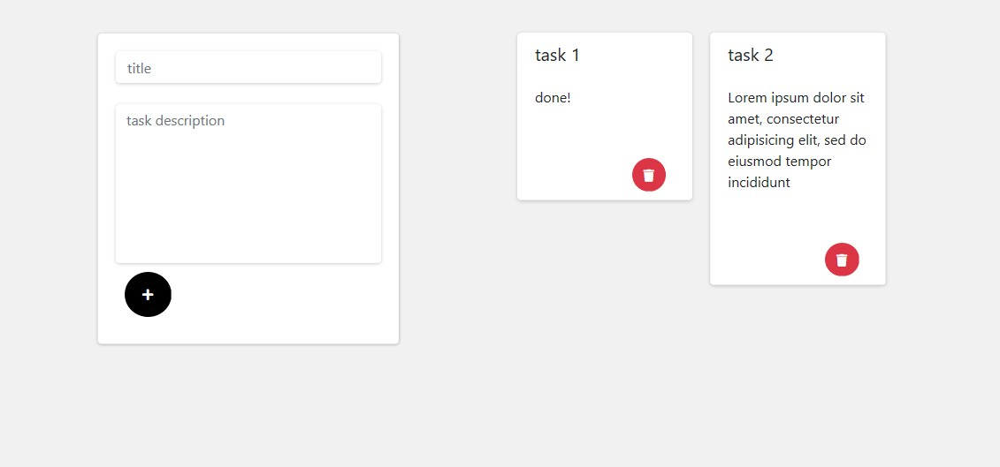

# to-do list
## Python, AJAX & MongoDB

## description
very minimalist and easy to use to-do list. It has a simple form,
in the same way it works through ajax so that you do not have 
reloading the page dozens of times 
## Install dependencies
> $ pip3 install -r requeriments.txt
## main file
> app.py

## usage
1. python3 app.py
2. start the browser
3. open **http://localhost:80** or **127.0.0.1**

## screenshot

## developer

### github
[LeonibelDev](https://github.com/LeonibelDev)

### linkedin
[Leonibel Segura](https://www.linkedin.com/in/leonibel-segura-473415173)
